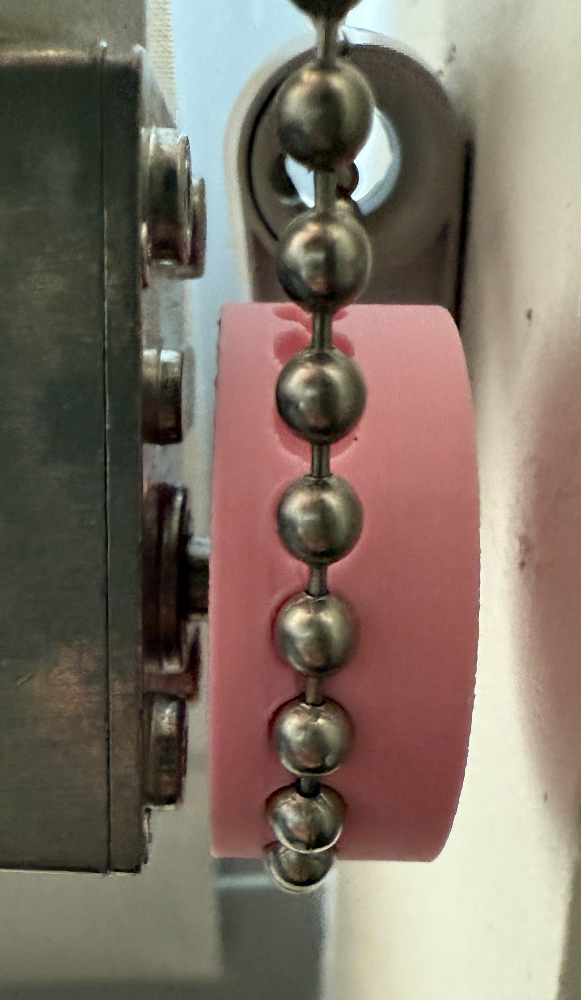

# AutoBlinds
### ECE 4180 - Embedded Systems Project

---

## Project Overview

This project automates the opening and closing of roller blinds operated by a beaded chain, enhancing user convenience
and accessibility. The system can be retrofitted to most existing chain operated blinds. It utilizes an ESP32-C6
microcontroller to control a DC motor to open, close, or move the blinds to specific positions. Users can interact with
the system through several methods: **tactile switches** for manual operation, **time-of-flight (ToF) sensor** for
proximity control, and a **web interface** for remote activation and configuring daily activation schedules. The system
operates using a finite state machine with several distinct modes:

* **Toggle Mode:** Default operation mode where pressing the Open/Close buttons or proximity detection via the ToF
sensor move the blinds to their configured positions.

* **Manual Mode:** Activated by a pressing the Mode button, allows for precise position control by holding the
Open/Close buttons. The system automatically returns to Toggle Mode after a set timeout.

* **Configuration Mode:** Activated by holding the Mode button, allows the user to set the fully open and closed
position limits into non-volatile memory by holding the Open/Close buttons. The system automatically returns to Toggle
Mode after a set timeout.

---

## System Components

* **Microcontroller (ESP32-C6-DevKitC-1):** Acts as the central processing unit, executing the main control loop and
state machine logic. It manages peripherals via GPIO and I2C, handles networking tasks (Wi-Fi connection via
`WiFiManager`, Network Time Protocol (NTP) synchronization, web interface via `ESPAsyncWebServer`), reads the encoder
with its internal Pulse Counter (PCNT) module, and controls the motor driver.

* **DC Motor w/ Encoder (JGY-370-EN):** A 158:1 geared DC motor that drives the physical movement of the blinds via the
beaded chain. Its integrated quadrature encoder provides rotational feedback for precise position tracking.
    + **3D-Printed Sprocket:** Mechanically couples the motor shaft to the beaded chain with the correct pitch and
        diameter. Model files available in `assets/`.  
        
        
        
        

* **Motor Driver (TB6612FNG):**

* **Time-of-Flight Sensor (VL53L0X):**

* **Timekeeping:**

* **Web Interface:**

* **Tactile Switches:**

* **RGB LED:**

* **Power Regulation (Buck Converter):**

---

## Problems Encountered

*

---

## Comparison to Real-World Systems

*

---

## Potential Improvements

*

---

## Dependencies

* **Preferences:**
    * Part of the Arduino Core for ESP32, used for non-volatile storage
    * License: [LGPL-2.1](https://github.com/espressif/arduino-esp32/blob/master/LICENSE.md) ([github.com/espressif/arduino-esp32](https://github.com/espressif/arduino-esp32))
* **ESP32PCNTEncoder (Custom Library):**
    * Derived from the ESP32Encoder library by hephaestus
    * License: [LGPL-3.0](LICENSE) (`LICENSE`)
    * Base Library
        * Copyright (C) 2018 hephaestus
        * License: [BSD-like](lib/ESP32PCNTEncoder/LICENSE_ESP32Encoder) (`lib/ESP32PCNTEncoder/LICENSE_ESP32Encoder`)
* **VL53L0X:**
    * Copyright:
        * (C) 2017-2022 Pololu Corporation
        * (C) 2016 STMicroelectronics International N.V.
    * License: [MIT+BSD-like](.pio/libdeps/esp32-c6-devkitc-1/VL53L0X/LICENSE.txt) (`.pio/.../VL53L0X/LICENSE.txt`)
* **WiFiManager:**
    * Copyright (C) 2015 tzapu
    * License: [MIT](.pio/libdeps/esp32-c6-devkitc-1/WiFiManager/LICENSE) (`.pio/.../WiFiManager/LICENSE`)
* **AsyncTCP:**
    * Copyright (C) 2016-2025 Hristo Gochkov, Mathieu Carbou, Emil Muratov
    * License: [LGPL-3.0](.pio/libdeps/esp32-c6-devkitc-1/AsyncTCP/LICENSE) (`.pio/.../AsyncTCP/LICENSE`)
* **ESPAsyncWebServer:**
    * Copyright (C) 2016-2025 Hristo Gochkov, Mathieu Carbou, Emil Muratov
    * License: [LGPL-3.0](.pio/libdeps/esp32-c6-devkitc-1/ESPAsyncWebServer/LICENSE) (`.pio/.../ESPAsyncWebServer/LICENSE`)
